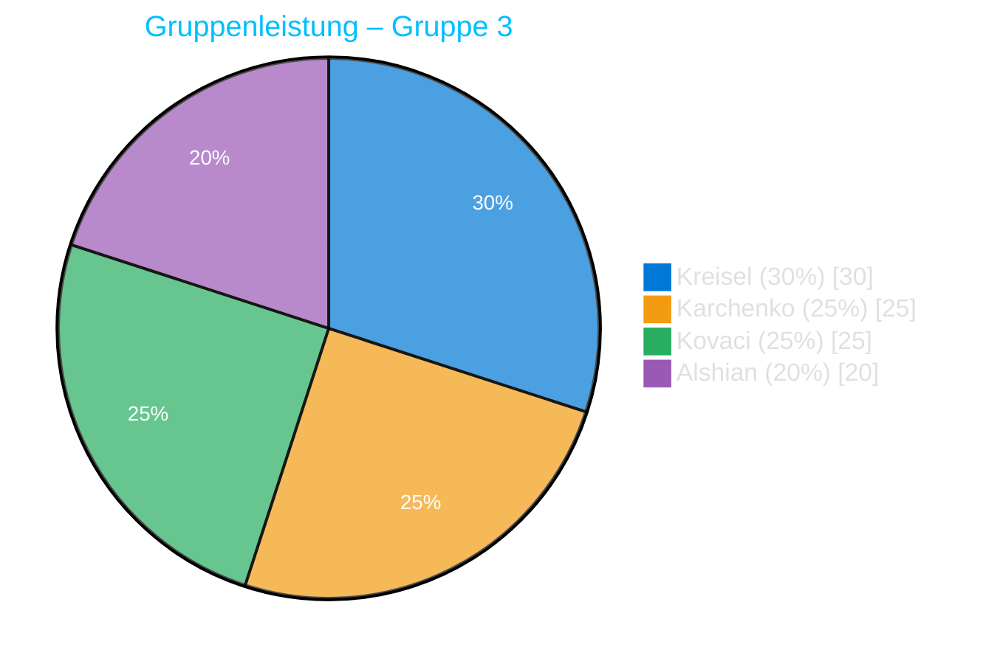

# 🌐 Website-Projekt – Gruppe 3 (Lorem Ipsum)

## 💡 Projektinhalt

- **Einfache Beispiele:**  
  Nutzung von **HTML**, **CSS** und **JavaScript** zur Erstellung einer kleinen Beispielseite.

- **Lokal ausprobieren:**  
  Die Website wurde in **Visual Studio Code** lokal getestet und im Browser geöffnet.

- **Gruppen-Repository:**  
  Ein gemeinsames **GitHub-Repository** wurde eingerichtet, um alle Änderungen zu speichern und zusammenzuführen.

- **VS Code Verbindung:**  
  Alle Teammitglieder arbeiteten über die integrierte Git-Anbindung in VS Code.

- **Website-Thema:**  
  „Lorem Ipsum“ – eine Beispiel-Website mit Dummy-Texten, einfachem Layout und CSS-Styling.

---

## 👥 Aufgabenverteilung

| Name          | Aufgabe(n)                                                           |
| ------------- | -------------------------------------------------------------------- |
| **Kreisel**   | Erstellung der Skripte (JavaScript) und dieser README-Datei          |
| **Karchenko** | Gestaltung mit CSS und Unterstützung bei der `index.html`            |
| **Kovaci**    | Hauptverantwortlich für die Struktur und Erstellung der `index.html` |
| **Alshian**   | Testen der Website (Fehlerprüfung, Funktionskontrolle, Feedback)     |

---

## 📊 Leistungsaufteilung

| Gruppe | Name      | Leistung (%) |
| ------ | --------- | ------------ |
| 3      | Kreisel   | 30%          |
| 3      | Karchenko | 25%          |
| 3      | Kovaci    | 25%          |
| 3      | Alshian   | 20%          |

---

## 🧭 Visualisierung der Leistung

